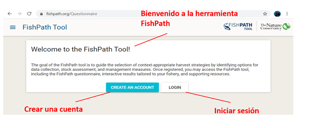
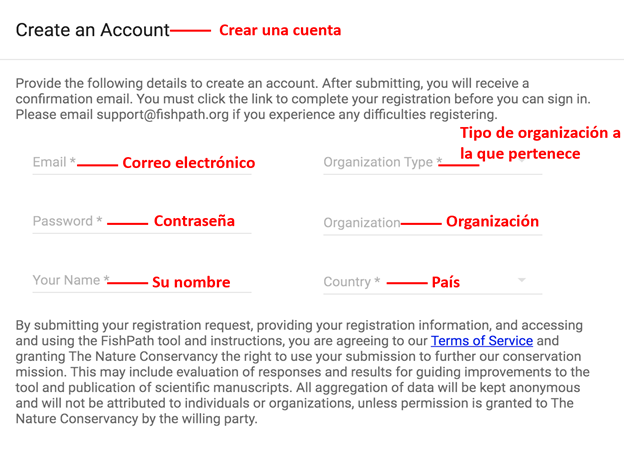
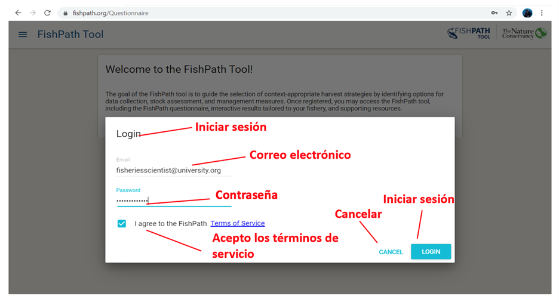
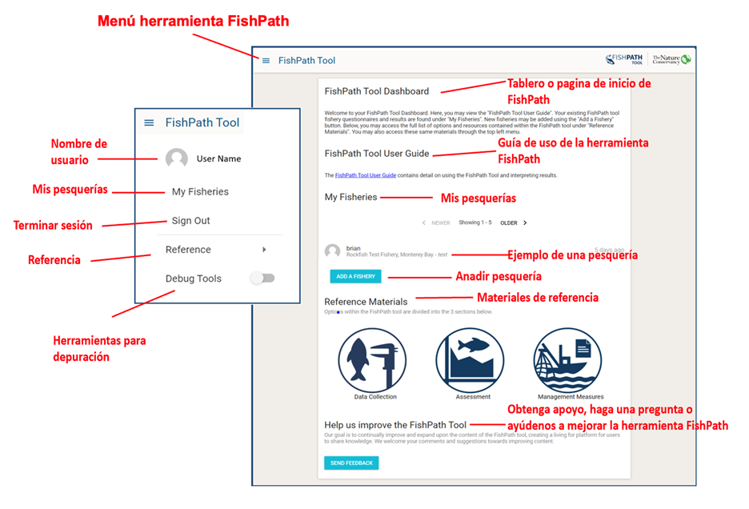
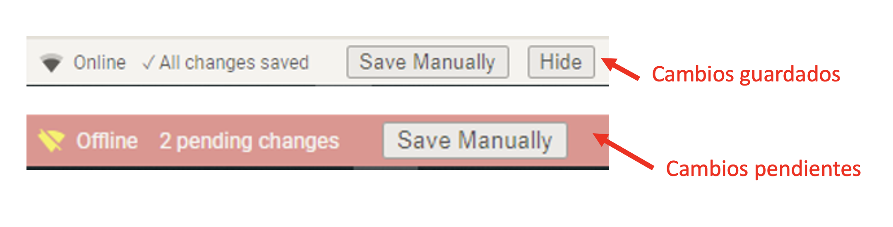
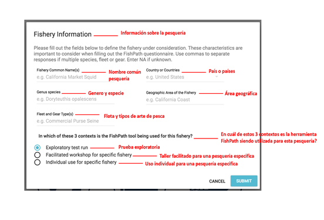
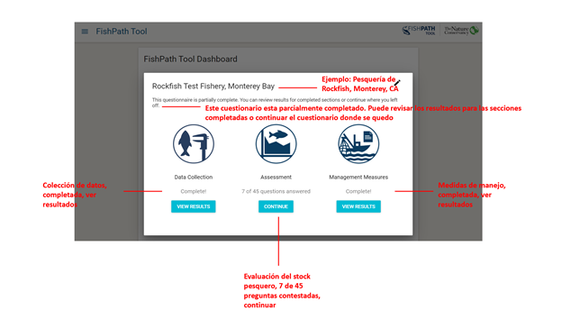

---
output:
  word_document: default
  html_document: default
---
<!-- Starting the FishPath Tool -->
# Iniciar la herramienta FishPath
Es importante notar que la herramienta FishPath requiere una conexión al internet constante para poder acceder al cuestionario, guardar las respuestas e interactuar con los resultados.

<!-- Welcome Page -->
## Página de Bienvenida
Cuando un usuario navega la página https://www.tool.fishpath.org/, aparece un mensaje de bienvenida con dos opciones: “Crear cuenta” o “ Iniciar sesión” (Figura \@ref(fig:welcome)).

```{r welcome, echo=FALSE, fig.cap='Página de bienvenida para la herramienta FishPath y su traducción al español ', fig.align='center', out.width='95%', fig.show='hold'}

```

<!-- Creating a FishPath Account -->
## Crear una cuenta FishPath
Al seleccionar “Crear una cuenta” (o “Create an account”), una ventana aparecerá solicitando la siguiente información (Figura \@ref(fig:create-account)). Un asterisco denota la información que es obligatoria proveer.

- Correo electrónico\*
- Contraseña\* (Debe crear una contraseña)
- Tipo de organización a la que pertenece\*
- Organización
- Su nombre\*
- País de origen\*

Es importante recordar que al ingresar su correo electrónico y su contraseña debe asegurar que utiliza adecuadamente letras mayúsculas y/o minúsculas.

Esta información será utilizada para poder rastrear el origen y el uso de la herramienta FishPath. Durante el paso de creación de la cuenta, también se indicará al usuario leer y aceptar los términos de servicio de la herramienta FishPath, elaborados por The Nature Conservancy ([Appendix B](#terms)).

```{r create-account, echo=FALSE, fig.cap='Pantalla de “Crear una cuenta” de la herramienta FishPath', fig.align='center', out.width='95%', fig.show='hold'}

```

Despues de enviar una solicitud de cuenta, el usuario recibirá un correo de confirmación con un vínculo para completar el registro de su cuenta. Después de la creación de su cuenta, el usuario puede retornar cuando quiera a la página de Bienvenida en la herramienta FishPath al iniciar la sesión ingresando su correo y contraseña (Figura  \@ref(fig:login-page)).

```{r login-page, echo=FALSE, fig.cap='Login Page of the FishPath Tool.', fig.align='center', out.width='95%', fig.show='hold'}

```

<!-- FishPath Tool Dashboard -->
## Tablero de la herramienta FishPath
Después de crear una cuenta (nuevo usuario) o de iniciar sesión (usuario existente), el usuario es dirigido al tablero o la “página principal” de la herramienta FishPath (Figura \@ref(fig:dashboard)). En este tablero/página los usuarios ven 4 encabezados:

1. **“Guía de uso de la herramienta FishPath”** el cual contiene todos los detalles para utilizar la herramienta FishPath e interpretación de los resultados.
2. **“Mis pesquerías”**, en donde se enlistan las pesquerías que el usuario ha iniciado o completado dentro de la herramienta. Usuarios pueden acceder a sus pesquerías en cualquier momento y pueden retornar a cuestionarios que se encuentren en progreso o a la página de los resultados.
3. **“Materiales de referencia”**, el cual provee una lista de todas las opciones disponibles en la herramienta FishPath con detalles y materiales de referencia a las mismas y en donde se puede descargar la lista de preguntas.
4. **“4.	Obtener apoyo, hacer una pregunta o ayudar a mejorar la herramienta FishPath”**, que permite al usuario enviar preguntas o sugerencias al equipo FishPath.

```{r dashboard, echo=FALSE, fig.cap='El tablero de la herramienta FishPath o la página principal para los usuarios que muestra los 4 encabezados descritos anteriormente. De la misma manera, al seleccionar la opción “Menú herramienta FishPath” (o “FishPath Tool”) en la esquina superior izquierda, se despliega un menú que permite al usuario navegar una serie de opciones.', fig.align='center', out.width='95%', fig.show='hold'}

```

<!-- FishPath Tool Side Bar Menu -->
#### Menú Herramienta FishPath
En el lado superior izquierdo de la pantalla, los usuarios pueden ver una opción que dice “Menú herramienta FishPath” (o “FishPath Tool”) y al hacer click en las 3 líneas horizontales aparece una ventana emergente con un menú. Este menú permite al usuario poder regresar al tablero, poder salir de su cuenta, acceder materiales de referencia y poder habilitar una opción llamada “Saving status toolbar”.

Esta opción notificará al usuario sobre el estatus de su cuestionario, respuestas y resultados (Figura \@ref(fig:saving-status)). Este barra de herramientas aparece abajo de la pantalla del cuestionario y le dice al usuario si sus respuestas han sido guardadas. Si las respuestas han sido guardadas, el texto mostrará “All changes saved”. En el case de que no tenga buen internet, es posible que las respuestas no se guarden e inmediatamente va a aparecer una notificación en rojo indicando que no se han guardado los cambios o “Changes pending” mientras la herramienta continua tratando de guardar. Los usuarios no deben cerrar o refrescar el servidor hasta que las respuestas hayan sido guardadas, de lo contrario, es probable que los cambios no se guarden y se pierda su progreso. Para mayor información sobre cómo usar la herramienta en contextos de conectividad limitada, por favor revise [este sección de preguntas FAQ abajo](#faq-internet). 


```{r saving-status, echo=FALSE, fig.cap='Saving Status Toolbar functionality. The top image shows saved; the bottom image shows changes pending.', fig.align='center', out.width='95%', fig.show='hold'}

```

<!-- Adding a New Fishery -->
## Añadir una pesquería
Al seleccionar el botón azul de “Añadir una pesquería” el usuario podrá empezar una pesquería nueva en la herramienta FishPath que será añadida a su cuenta. Primero, una ventana aparecerá llamada “Información sobre la pesquería”, la cual dará lugar a los usuarios a definir aspectos generales de la pesquería de interés (Figura \@ref(fig:fishery-info)), usando los campos que se proveen a continuación. Esta información ayuda a los usuarios a definir mejor la pesquría a la que aplicarán la herramienta FishPath, para que las respuestas sean dirigidas únicamente a esa pesquería de interés. Esta información también es útil para TNC para entender mejor el uso de la herramienta de FishPath y proveer información de alto nivel de las características de la pesquería.

Las pesquerías y la información guardada en la herramienta de FishPath (incluyendo respuestas, notas y resultados) es accesible únicamante para los usuarios que ingresaron los datos y para los administradores de la herramienta FishPath. Si el usuario desea, puede [**compartir sus resultados**](#Results-Actions) con otros usuarios.

-	Nombre común de la pesquería
-	Género y especie
-	Flota y tipos de arte de pesca
- País o Países
-	Área geográfica de la pesquería 
-	En cuál de estos 3 contextos es la herramienta FishPath siendo utilizada para esta pesquería?
    -	Prueba exploratoria  
    -	Taller facilitado para una pesquería especifica
    -	Uso individual para una pesquería especifica


```{r fishery-info, echo=FALSE, fig.cap='Campos de información que aparecen en la ventana llamada “Información sobre la pesquería”', fig.align='center', out.width='95%', fig.show='hold'}

```

Al seleccionar la opcion “Ingresar” (o “Submit”), el usuario deberá seleccionar uno de los 3 componentes de la estrategia de capturas (secciones) de la herramienta FishPath (colecta de datos, evaluación del stock y medidas de manejo) y empezará el cuestionario de la herramienta FishPath. Los usuarios pueden completar y ver sus resultados de cualquiera de estas secciones de manera independiente. Un ícono de un lápiz en la esquina superior derecha permite al usuario editar la información de la pesquería en cualquier momento (Figura \@ref(fig:fishery-entry)).


```{r fishery-entry, echo=FALSE, fig.cap='Pantalla de entrada al cuestionario de la herramienta FishPath después que la información sobre la pesquería ha sido definida.', fig.align='center', out.width='95%', fig.show='hold'}

```
