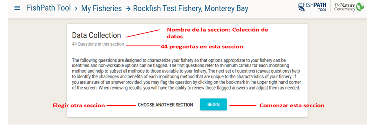
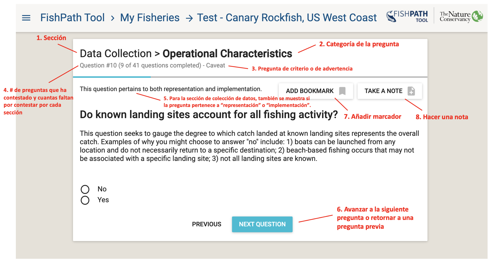
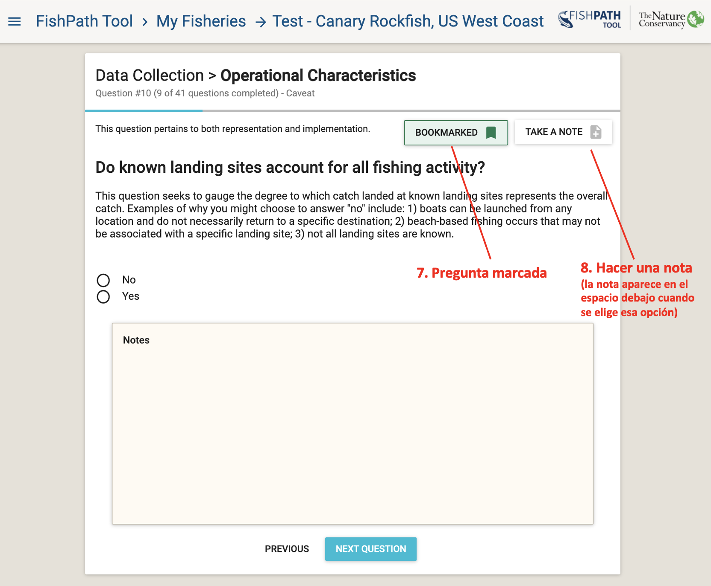
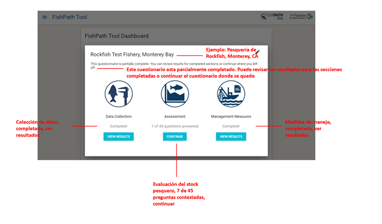
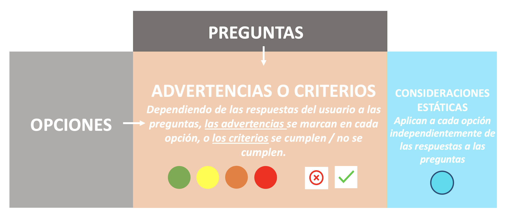

# Cuestionario de la herramienta FishPath

La meta del cuestionario de la herramienta FishPath es obtener información sobre todos los aspectos de la pesquería. Esta información conlleva a la activación de ciertos supuestos, precauciones y consideraciones a tener en cuenta para cada opción. A través de las tres secciones (colecta de datos, evaluación del stock y medidas de manejo) el usuario contesta alrededor de ~120 preguntas. Las preguntas están divididas en 6 categorías, las cuales indican la naturaleza de la información que se busca:

1. Biología/ ciclos biológicos y ecológicos de la especie
2. Disponibilidad de datos
3. Gobernanza
4. Manejo 
5. Características operacionales
6. Características socioeconómicas 

Algunas preguntas son relevantes para múltiples secciones (colecta de datos, evaluación y medidas de manejo). Una vez que hayan sido contestadas, estas no van a aparecer en otras secciones subsecuentes. Para más información sobre cómo se muestran las preguntas que abarcan varias secciones, consulte estas [preguntas frecuentes a continuación](#faq-question-numbering). 

En cualquier momento, el usuario puede cerrar sesión y retornar a la misma a través de la opción “Mis pesquerías” en la página de Inicio o tablero de la herramienta. Una vez que el usuario haya completado una sección, se puede revisar los resultados o puede continuar con la siguiente sección. Los resultados de las secciones se hacen disponibles una vez que el usuario completa todas las preguntas del respectivo cuestionario.

Después de revisar la página de entrada al cuestionario FishPath (Figura \@ref(fig:fishery-entry)), el usuario debe seleccionar una de las 3 secciones. Debajo del nombre de cada sección, se mostrará el número de preguntas dentro de dicha sección y un párrafo que explica cómo contestar las preguntas (Figura \@ref(fig:dc-overview)). El usuario puede elegir la opción de “Comenzar” (“Begin”) la sección o “Elegir otra sección” (“Choose Another Section”).

```{r dc-overview, echo=FALSE, fig.cap='Visión general de la sección colecta de datos', fig.align='center', out.width='95%', fig.show='hold'}

```

## Anatomía de una pregunta dentro de la herramienta FishPath
La figura \@ref(fig:question-anatomy) y la figura \@ref(fig:bookmark-notes) provee un ejemplo de lo que se observa en la pantalla cuando se quiere contestar una pregunta dentro de la herramienta:

 ```{r question-anatomy, echo=FALSE, fig.cap='Anatomia de una pregunta dentro de la herramienta FishPath.', fig.align='center', out.width='95%', fig.show='hold'}

```

1.	En la parte superior de la pantalla, se muestra la **sección**: colecta de datos, evaluación del stock o medidas de manejo. 
2.	Al lado de la sección, se muestra la **categoría de cada pregunta** (i.e., Biología/historia de vida, Disponibilidad de datos, Gobernanza, Manejo, Características Operacionales o Características socioeconómicas). 
3.	Debajo del nombre de la sección y categoría de cada pregunta, se muestra un pequeño encabezado que muestra si la pregunta es de **“criterio” o de “advertencia”**.
4.	Este encabezado muestra el **número de preguntas que ha contestado** y cuantas faltan por contestar dentro de esa sección. 
5.	Para la sección “Colecta de datos”, también se muestra si la pregunta es de “representación” o “implementación”. Esto indica al usuario si la pregunta tiene implicaciones en la habilidad de colectar datos representativos o de implementar un programa de colecta de datos, o ambos. La intención es ayudar al usuario a entender y responder de mejor manera la pregunta.
6. Abajo de la pantalla, el usuario puede avanzar a **la próxima pregunta (o “Next Question”)** o retornar a **la pregunta anterior (o “Previous”)**. 
7. Hay una opción de **“Marca la pregunta” (o “Bookmark”)**. Al marcar ciertas preguntas da facilidad al usuario de poder revisarlas posteriormente (Figura \@ref(fig:bookmark-notes)). Una pregunta puede ser marcada por distintas razones, tales como: desconocimiento sobre la respuesta, necesita mayor discusión para llegar a un acuerdo, se necesita consultar cierta información, el usuario considera que la pregunta es crítica, etc. Como todas las preguntas deben ser contestadas para revisar los resultados, añadir un marcador permite al usuario proveer una respuesta temporal que puede ser revisada y modificada en la sección de resultados, una vez que el usuario pueda evaluar el impacto relativo de dicha respuesta.
8.  Los usuarios pueden **“hacer una nota” (o “Take a Note”)** en cualquier pregunta (Figura \@ref(fig:bookmark-notes)). Las notas también sirven para múltiples razones, como clarificar porqué cierta respuesta fue dada, capturar una discusión importante , indicar que se necesita investigar más antes de responder, etc. Posteriormente, las notas pueden formar parte de un borrador para el desarrollo de una estrategia de capturas y al proveer justificación a respuestas, se tendrá replicabilidad y trazabilidad. Al estar conectado al internet, todas las notas serán guardadas dentro de la herramienta FishPath y podrán ser utilizadas como referencia por el usuario.
 

 ```{r bookmark-notes, echo=FALSE, fig.cap='Ejemplo de una pregunta dentro de la herramienta FishPath con la pregunta marcada (en verde) y la nota agregada (caja de texto).', fig.align='center', out.width='95%', fig.show='hold'}

```

<!-- Criteria and Caveat Questions -->
## Preguntas de “Criterio” o “Advertencia”
Las preguntas se designan como “criterio” o “advertencia” o ambos, lo cual se refiere a cómo las respuestas se vinculan a las preguntas contenidas dentro de la herramienta.

Una pregunta de criterio determina si la pesquería cumple con la mínima calificación requerida para aplicar una opción. Preguntas cuyas respuestas invoquen “advertencias” no van a eliminar o retener opciones, pero van a invocar advertencias de colores (rojo, amarillo, anaranjado) o atributos positivos (verdes) contra opciones específicas.

<!-- Subjective Questions -->
## Preguntas subjetivas

Mientras que la mayoría de las preguntas en la herrameinta FishPath se pueden contestar definitva y objetivamente, también hay ciertas preguntas subjetivas por su naturaleza. Por ejemplo, una pregunta subjetiva puede requerir que se clasifiquen ciertas caracetrísticas de la pesquería en una escala (ejemplo: bajo, medio y alto). Este diseño subjetivo es intencional, ya que permite a los usuarios pensar en características clave, relativas a su pesquería que van a impactar la viabilidad de implementar ciertas opciones de manejo.

Generalmente, el mejor enfoque al completar el cuestionario es hacerlo de manera eficaz, sin perder mucho tiempo en debatir sobre ciertas preguntas. Cuando se tenga una duda, la pregunta puede ser marcada, o se pueden tomar notas, para poder revisar la pregunta posteriormente. La transparencia de la herramienta FishPath es tal que los usuarios pueden ver como su respuesta a cualquier pregunta impacta los resultados (por medio de los criterios y consideraciones) y que los usuarios pueden [**cambiar su respuesta si así lo desean**](#Bookmark-Influential). Además, el objetivo del cuestionario es el de obtener un vistazo general de las características de la pesquería, para poder informar mejor las opciones de la estrategia de capturas. Como tal, las preguntas pueden impactar a pocas opciones o puede que no invoquen fuertes advertencias. El objetivo es apreciar la pesquería en su totalidad, más que enfocarse a una sola pregunta.

<!-- Completing the Questionnaire -->
## Completar el cuestionario
Al completar o salir de cualquiera de las tres secciones, aparecerá una ventana indicando el estado o progreso del cuestionario (Figura \@ref(fig:summary-screen)). Los usuarios podrán revisar los resultados  para aquellas secciones completadas o de otra manera, continuar con el cuestionario.

<!-- TODO: is this the paragraph that Mariana commented on? -->
<!-- The questionnaire is periodically updated by the FishPath team to reflect the latest fisheries science. If there are any new or outstanding questions, the section will no longer display as “Complete” in the pop-up summary window (Figure \@ref(fig:summary-screen)) when returning to a fishery questionnaire. Instead, the number of new questions needing to be answered will be displayed (e.g., “45 of 46 questions answered”). For more information on questionnaire updates, please see [this FAQ below](#faq-content-updates). -->

 ```{r summary-screen, echo=FALSE, fig.cap='Ventana con el resumen de las 3 secciones del cuestionario FishPath, demostrando el progreso del cuestionario.', fig.align='center', out.width='95%', fig.show='hold'}

```

<!-- FishPath Tool Conceptual Framework -->
## Marco conceptual de la herramienta FishPath
En un panorama general, la herramienta FishPath es un marco conceptual que combina las respuestas del usuario al cuestionario con más 150 opciones contenidas dentro de la herramienta (Figure \@ref(fig:conceptual)). En otras palabras, las respuestas de los usuarios a las preguntas ayudan a caracterizar la pesquería. Cada respuesta puede disparar consideraciones cuando se aplica una opción a la pesquería. Estas consideraciones (y tipos de preguntas) pueden tomar dos formas. Los criterios denotan que la pesquería cumple o no cumple con los requerimientos básicos para poder usar cierta opción. Alternativamente, las advertencias se clasifican según su intensidad, en colores de semáforo, o advertencies estáticas que siempre aplican a la opción.

<!-- TODO: update caption -->
 ```{r conceptual, echo=FALSE, fig.cap='High level, conceptual framework of the FishPath Tool, demonstrating the linkages between questions, options, and criteria or caveats.', fig.align='center', out.width='95%', fig.show='hold'}

```

<!-- FishPath Tool: Framework Overview of the 3 Sections  -->
### Herramienta FishPath: Visión general del marco conceptual y sus 3 secciones

<!-- Data Collection Section -->
#### Sección de colecta de datos
La sección de colecta de datos busca apoyar al usuario en entender qué categorías generales de información colectar y los mecanismos para hacerlo, que sean óptimos para el contexto de la pesquería, las capacidades, y realidades para la implementación en sitio.

Existen diversas opciones para la colecta de datos (desde encuestas de mercados hasta bitácoras de pesca y programas de observadores a bordo). Estas opciones se subdivididen de acuerdo a la categoría general de información que puede ser colectada, ya que ésta influenciará la viabilidad de la opción para la colecta de datos. Las [**cuatro categorías de datos**](#Data-Categories) en la herramienta FishPath son: 1) datos que arrojan un conocimiento básico de la pesquería; 2) información biológica; 3) datos que informan análisis de tendencias temporales (datos de series de tiempo); y 4) datos con calidad suficiente para poder informar una evaluación del stock.

<!-- Assessment Section -->
#### Sección de evaluaciones
La sección de evaluaciones de stock permite al usuario entender los métodos disponibles y más apropiados para evaluar pesquerías con datos limitados. En la herramienta FishPath, una evaluación se define como cualquier análisis o indicador de desempeño que provee información, ya sea por medidas directas o indirectas del estado del stock, y que sea útil para el manejo. Esto puede variar desde “motivo de preocupación” proveniente de una opinión de un experto pesquero, análisis de riesgo cualitativas, valores empíricos de indicadores relativos a niveles predefinidos que desencadenan ciertos resultados, marco de indicadores múltiples, análisis de la historia de vida de la especie que proveen estimaciones de la mortalidad de pesca F, o la mortalidad de pesca cuando la pesquería se encuentra en su rendimiento máximo sostenible FMSY, modelos basados en capturas, modelos basados en tallas, hasta modelos de dinámica poblacional para estimar la biomasa. 
     
Con base en las características de cada pesqueria y en la calidad y el tipo de datos disponibles (proveniente del cuestionario) el usuario marca advertencias y criterios contra las [**opciones de evaluación del stock**](#Assessment-Categories).

<!-- Management Measure Section -->
#### Sección de medidas de manejo
La sección de medidas de manejo permite al usuario revisar y filtrar las opciones apropiadas para manejar la mortalidad de la pesqueria. Las [**opciones de medidas de manejo**](#Management-Measure-Categories) pueden tomar diversas formas incluyendo restricciones espaciales, temporales, de esfuerzo, de captura y de las artes de pesca.  La herramienta FishPath no tiene criterios mínimos para las medidas de manejo pero utiliza advertencias. Múltiples medidas de manejo pueden y deberían de utilizarse en conjunto. La herramienta FishPath no es prescriptiva ni ofrece guianza en la forma específica de las reglas de cosecha, sin embargo, puede dirigir u orientar a los usuarios hacia recursos y herramientas que pueden apoyar este proceso, ubicados dentro de las descripciones de cada opción.