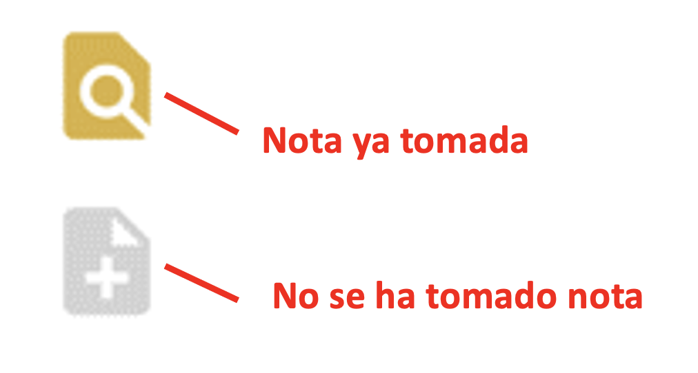

<!-- FishPath Tool Interactive Results Page -->
# Página interactiva de Resultados de la herramienta FishPath
La página interactiva de resultados de la herramienta FishPath permite a los usuarios visualizar e interactuar con las opciones contenidas dentro de FishPath para poder entender como cada opción puede ser aplicable a su pesquería.

Al completar el cuestionario para cada sección, el usuario es dirigido a la página interactiva de resultados de la herramienta FishPath (Figura \@ref(fig:results-overview)). Los resultados son presentados separadamente para cada una de las 3 secciones, o componente de la estrategia de capturas: 1) colecta de datos; 2) evaluación del stock; y 3) medidas de manejo (Figura \@ref(fig:results-overview), las secciones se muestran en azul oscuro, cerca del principio de la pantalla).

Se puede acceder a cada una de las tres secciones de resultados individualmente sin necesidad de completar las tres secciones. Si un usuario no ha completado el cuestionario por lo menos de una sección, serán dirigidos a completar el cuestionario de la sección antes de poder acceder a sus resultados (Figura \@ref(fig:summary-screen)).

En esta sección los usuarios deben comenzar con el proceso “Narrow your Results” o reducir sus resultados (Figura \@ref(fig:results-overview), botón azul). Abajo, la funcionalidad y disposición de la pantalla es explicada, seguida por los pasos a seguir en el proceso de reducir las opciones de sus resultados.


```{r results-overview, echo=FALSE, fig.cap='Resultados iniciales en la pantalla de resultados de la herramienta FishPath (en la imagen se muestra la sección de evaluaciones de stock), mostrando únicamente un extracto de los resultados, no de la lista completa.', fig.align='center', out.width='95%', fig.show='hold'}
knitr::include_graphics('images/results-overview-es.png')
```

La figura \@ref(fig:results-components) muestra los componentes generales de la página de resultados. Cada uno se detalla a continuación:  


1.	[Tabla interactiva de resultados](#interactive-results-table)
2.	[Mostrar opciones escondidas y ordenar opciones](#Filters-Sorting)
3.	[Preguntas que han sido marcadas y respuestas influyentes](#Bookmark-Influential)
4.	[Resultados del proceso de reducción de opciones](#Results-Narrowing)
5.	[Acciones para compartir resultados y editar información de la pesquería](#Results-Actions)
6.  [Modo de ver únicamente (para compartir la información de una pesquería)](#View-Only)

```{r results-components, echo=FALSE, fig.cap='Componentes clave (etiquetas en rojo del 1-5) de la pantalla interactiva de los resultados de la herramienta FishPath.', fig.align='center', out.width='95%', fig.show='hold'}
knitr::include_graphics('images/results-components-es.png')
```

<!-- Interactive Results Table -->
## Cuadro interactivo de resultados {#interactive-results-table}
La lista de resultados contiene las opciones disponibles para esa sección. Cada fila representa una opcion (Figura \@ref(fig:result-rows)) y resume qué criterio se cumplió o falló y qué advertencias surgieron, entre otros detalles. Cada opción puede ser seleccionada y expandida para ver su descripción y lista de criterios y advertencias. Cada componente de las filas se explica a continuación.

```{r result-rows, echo=FALSE, fig.cap='Ejemplo de la tabla de resultados de la herramienta FishPath y 3 opciones (3 filas). Esta es la sección de evaluación.', fig.align='center', out.width='95%', fig.show='hold'}
knitr::include_graphics('images/results-rows-es.png')
```

<!-- Table Structure -->
### Estructura de la tabla

- **Esconder/ Mostrar:** Cualquier opcion para la cual uno o mas de sus mínimos criterios no se cumplieron en la pesquería, son automáticamente “escondidos” (se vuelve color gris) por la herramienta FishPath (Figura \@ref(fig:hide)). Para cualquier opción, incluyendo las que no cumplen criterios mínimos, los usuarios pueden manualmente hacer click en la opcion “hide” -o esconder o en la opción “unhide”-mostrar. Las opciones escondidas solo se muestran cuando el botón "Mostrar opciones escondidas" (o “Show Hidden Options”) está activada.

```{r hide, echo=FALSE, fig.cap='Habilidad de esconder (“hide”) o mostrar (“unhide”) opciones.', fig.align='center', out.width='10%', fig.show='hold'}

```

- **Notas:** : Al igual que el cuestionario, las notas pueden ser elaboradas y guardadas (con una conexión estable al internet) para cada opción (Figura \@ref(fig:notes)). Las notas pueden incluir detalles específicos de cada pesquería (que no se cubren dentro del cuestionario), por ejemplo, el porqué esa opcion puede ser o no ser una buena elección para la pesquería, o para registrar la opinión del usuario o del grupo sobre esa opcion cuando se consideran las advertencias. Igualmente, las notas pueden ser sobre opciones abiertas o  escondidas, para poder usarse como justificación. Las notas serán incluidas en el reporte PDF.

```{r notes, echo=FALSE, fig.cap='El ícono superior muestra una opción con una nota ya tomada. Haga clic para ver o editar la nota. El ícono de la parte inferior significa que no se ha tomado nota de la opción. Haga clic para crear una nueva nota.',fig.align='center', out.width='15%', fig.show='hold'}

```

- **Criterios (Secciones de colecta de datos y evaluación del stock):** La columna de criterios provee información sobre si la pesquería cumple con las condiciones mínimas para poder elegir cierta opción. Si la pesquería cumple dichos criterios, una palomita verde aparecerá. Por otro lado, si la pesquería no cumple con uno o más de los criterios mínimos requeridos para una opción, una cruz roja aparecerá (y la opción es “escondida” automáticamente).

Para la sección de colecta de datos los criterios son cumplidos o no cumplidos (Figura \@ref(fig:dc-criteria)). En una opción eliminada, las cajas color negro indican el numero de criterios mínimos que no fueron cumplidos. Las cajas color verde indican el número de criterios que fueron cumplidos.


```{r dc-criteria, echo=FALSE, fig.cap='Ejemplo de íconos de criterios de colecta de datos. La fila superior muestra una opción que ha sido eliminada, indicada con la cruz roja. Se eliminó debido a que 1 de los 4 criterios no cumplía con el requisito mínimo. La fila inferior muestra una opción que “pasó” o se aceptó, indicada por la palomita verde. La opción cumplió con los requisitos de ambos criterios.', fig.align='center', out.width='35%', fig.show='hold'}
knitr::include_graphics('images/dc-criteria-es.png')
```

<ul> <li style="list-style-type: none;">
Para la sección de evaluaciones también hay criterios que se cumplen o no cumplen (Figura \@ref(fig:a-criteria)). Los criterios que se cumplen tienen colores de semáforo asociados (rojo, anaranjado, amarillo y verde). Los colores representan la calidad de cada tipo de datos y sirven como guía para que los usuarios consideren la incertidumbre asociada a usar dichos datos en los métodos de evaluación. Por ejemplo, se tiene una serie de tiempo de las remociones de la pesquería pero no se cuenta con datos de remoción de una flota importante. La respuesta para esta pregunta reflejará este sesgo. En los resultados, las opciones que requieren series de tiempo de las remociones (de cualquier calidad) desplegarán que este criterio se cumplió, pero se cambiará a color anaranjado para representar que existe alta incertidumbre en los datos de remoción. Esto es un recordatorio de que el usuario necesita considerar la incertidumbre al realizar evaluaciones e interpretar los resultados. 

El número de criterios “No cumplidos” para cada opción se muestra en la caja negra, mientras que los criterios cumplidos tienen colores que corresponden a cada nivel de incertidumbre. En otras palabras, la caja negra indica el número de criterios mínimos que no fue cumplido, mientras que la suma de los números en las cajas de colores equivalen al número total de critierios cumplidos.
</li></ul>

```{r a-criteria, echo=FALSE, fig.cap='Ejemplo de los íconos de criterios de evaluación. La fila superior muestra una opción que ha sido eliminada debido a tres criterios que no se cumplieron, cuyo número se puede observar en la caja negra. La fila inferior muestra una opción que cumple con los criterios, representada por una palomita verde. Para ambas filas, cada color de semáforo muestra el número de criterios que cumplen y la severidad de advertencia sobre la incertidumbre.', fig.align='center', out.width='35%', fig.show='hold'}

```

- **Advertencias:** El formato de la columna de advertencias es el mismo para las tres secciones (Figura \@ref(fig:caveats)). Las advertencias se muestran en círculos de colores con números que indican el número total de respuestas del cuestionario que dispararon una advertencia de ese color. Hay tres tipos de advertencia:

The format of the caveats column is identical across all three sections (Figure \@ref(fig:caveats)). Caveats are shown as colored circles with numbers indicating the total number of questionnaire responses that invoked a caveat of that particular color. There are three types of caveats:

  1.	**Advertencias de precaución o cuidado:** Estas son marcadas con círculos rojos, anaranjados y amarillos con la severidad de la advertencia indicada por su color (rojo siendo la mas alta). Estos proveen una guía basada en los atributos de una pesquería. Por ejemplo, si el usuario responde que la especie de interés es susceptible a barotrauma, esto dispararía una advertencia en rojo sobre utilizar límites en la talla de captura como una medida de manejo, debido a la mortalidad por pesca, indicando que los límites de talla no son una medida adecuada.
  2.	**Atributos positivos:** Un atributo color verde provee razones del porqué una opción puede ser apropiada para la pesquería con base en las respuestas del cuestionario.
  3.	**Consideraciones estáticas:** Las consideraciones color azul claro son consideraciones estáticas que deben ser tomadas en cuenta, sin importar la pesquería o la respuesta del cuestionario.  Una consideración estática es independiente de las circunstancias de una pesquería especifica y por ende siempre están presentes. Estas incluyen supuestos clave para evaluaciones, por ejemplo, la evaluación del stock asume que la selectividad de la pesquería no ha cambiado a través del tiempo o que no puede abordar la incertidumbre.

```{r caveats, echo=FALSE, fig.cap='Ejemplo del número de advertencias de precaución (colores de semáforo), atributos positivos (verdes) y consideraciones estáticas (azul claro) para una opción.', fig.align='center', out.width='35%', fig.show='hold'}
knitr::include_graphics('images/caveats-es.png')
```

- **Categoría:** La columna de categoría permite a los usuarios ver las opciones por categoría. Esta columna es diferente para cada seccion.
<!-- Data Categories -->
  - ##### Categoría de Datos {#Data-Categories}
  En la **sección de colecta de datos**, la columna “Data Category” o categoría de datos muestra las cuatro categorías de datos que pueden ser colectados.
    a. **Entendimiento básico de la pesquería.** Cuando se tiene poco conocimiento de la pesquería, los usuarios podrían empezar colectando información general u operativa de la pesquería para obtener un mejor entendimiento. Donde hay pocos recursos disponibles esta puede ser la única opción de datos/información, aunque se debería aspirar a un esfuerzo que vaya más allá de este paso para hacer el uso más eficiente de la capacidad. La información colectada puede ser dependiente o independiente de la pesquería; puede ayudar a los usuarios a entender más sobre el tamaño y composición de la flota, identificar el tamaño total del área que está siendo pescada, determinar las artes de pesca utilizadas, hacer estimaciones sobre las capturas y esfuerzo, y colectar otra información que ayude a entender la pesquería.
    b. **Análisis de tendencias temporales (series de tiempo).** Los datos colectados para realizar análisis de series de tiempo son usados para monitorear patrones temporales en indicadores de desempeño de la pesquería (captura, esfuerzo, CPUE, y composición de capturas), indicadores ecosistémicos, e indicadores de la biología de las especies. En ausencia de estimadores de biomasa, tendencias temporales de otros indicadores de desempeño pueden ser usados para monitorear la salud de la pesquería a través del tiempo. Los datos para el análisis de tendencias temporales deben ser colectados de manera regular, en intervalos consistentes y comparables (por ejemplo, colectados de las mismas artes de pesca, áreas de pesca similares, etc.).
    c. **Información biológica.** Datos biológicos son colectados al obtener muestras de la población, tomando información biométrica (por ejemplo peso y longitud del organismo), colectando información del sexo y madurez sexual, y/o colectando muestras biológicas para análisis posterior (típicamente relacionadas a la edad, por ejemplo de otolitos, escamas y dientes). Los datos biológicos proveen información clave para el entendimiento de la historia de vida de los organismos, como tasas de crecimiento y reproducción. Estos datos se usan para entender mejor el stock y proveer parámetros que alimentan evaluaciones de stock y modelos que estiman el estado del stock.
    d. **Para informar modelos de evaluación del stock.** El estatus del stock es estimado de manera formal (utilizando modelos de evaluación del stock). Una evaluación del stock provee un indicador (o proxy) del estado del stock, que puede ser comparado con puntos de referencia seleccionados. Los puntos de referencia se usan para indicar si un stock se encuentra en estado deseable o indeseable. Contrario al análisis de de tendencias temporales, los datos colectados aquí son usados para informar una evaluación cuantitativa que resulta en una estimación de la biomasa o mortalidad de pesca, y la categoría se refiere a datos detallados y confiables. Los datos colectados son usados para medir el estado del stock puede incluir series de tiempo robustas, esfuerzo pesquero, CPUE, composiciones de tallas y de peso, densidad dependiente de la pesca o abundancia independiente de la pesca. La mayoría de los métodos de evaluación requieren que cualquier muestreo biológico que se use para informar parámetros biológicos, debería ocurrir antes de, o en conjunto con, esfuerzos de colecta de datos para poder establecer puntos de referencia.

<!-- Assessment Categoires -->
  - ##### Categorías de evaluación {#Assessment-Categories}
  En la **sección de evaluación**, hay dos tipos de categorías para cada opción. “**Categoría de evaluación**” y “**Resultado de la evaluación**”.
    1. **1.	Categoría de la evaluación.** Organiza los métodos de evaluación con base en  familias generales de evaluaciones. Esto puede estar relacionado con el tipo de datos requeridos para cada opción (por ejemplo, solamente capturas) o el tipo de evaluación (análisis de riesgo/ vulnerabilidad).
        a. **Indicadores de abundancia.** Abundancia o un proxy de la abundancia es la fuente principal (por ejemplo, captura por unidad de esfuerzo o CPUE).
        b. **Únicamente captura.** Una historia de las capturas (remociones) es la fuente principal. Las opciones pueden usar diversos parámetros de la historia de vida, pero no usan otras series de tiempo o información de capturas basada en talla/edad, tal como de composición de tallas o indicies de abundancia.
        c. **Condición general del stock.** La condición general del stock es determinada por expertos utilizando la información disponible, sin el uso de modelos formales. 
        d. **Métodos basados en la historia de vida.** Los parámetros de la historia de vida son utilizados para determinar puntos de referencia que pueden ser usados para comparar con indicadores. 
        e. **Áreas Marinas Protegidas o reservas marinas.** Estas pueden comparar lo que hay dentro de una reserva marina y fuera de una reserva marina.
        f. **Indicadores múltiples.** Un marco conceptual que formaliza las medidas de manejo que deben tomarse usando comparaciones entre indicadores múltiples y puntos de referencia.
        g. **Modelos de dinámica poblacional.** Modelos estadísticos integrando dinámica poblacional, por ejemplo, cambios en números y tallas y/o edades en el tiempo.
        h. **Análisis de riesgo/ vulnerabilidad.** Usado para determinar cómo especies o ecosistemas que se encuentran en riesgo reaccionan ante sobrepesca o degradación.
        i. **Basado en edad/tallas.** Estas opciones utilizan la talla o edad de las capturas, tales como la estructura de tallas. Una serie de tiempo de la captura no es necesaria para todas las opciones pero es utilizada por algunas.
    2. **Resultado de la evaluación.** Los resultados de la evaluación son unidades que la evaluación del stock puede proveer. Hay 5 categorías basadas en los resultados, aunque algunas evaluaciones pueden proveer múltiples resultados .
        a. **Límite de captura.** Los niveles de capturas para aplicarse en medidas de manejo basado en capturas para cumplir objetivos de manejo. Por ejemplo la captura que correspende a un máximo rendimiento sostenible (MSY).
        b. **Tasa de pesca.** La tasa de pesca para ser usada en medidas de manejo basadas en esfuerzo para cumplir objetivos de manejo. Por ejemplo, una tasa de pesca puede ser comparada con un máximo rendimiento sostenible (MSY).
        c. **Estado del stock.** Abundancia relativa del stock.
        d. **Escala del stock.** La abundancia absoluta del stock. 
        e. **Otras métricas de reglas de control.** Cualquier indicador que no sea de los cuatro enumerados anteriormente, ejemplo: cambio en la composición de especies en las capturas.
        
        <!-- Management Measure Categories -->
  - ##### Categorías de medidas de manejo {#Management-Measure-Categories}
  En la **sección de medidas de manejo** esta columna se llama “Categoría” y muestra las categorías de medidas de manejo. Hay 8 categorías de medidas de manejo.
    a. **Limites de captura.** Los límites de captura buscan manejar de manera directa la mortalidad por pesca de las especies que son capturadas, al establecer un máximo del número de individuos, o el peso a ser capturado en la pesquería en un periodo de tiempo dado y/o en áreas específicas.
    b. **Límites de esfuerzo.** Los límites de esfuerzo buscan manejar la mortalidad por pesca ajustando la actividad de pesca de las flotas, para alinear con una tasa de explotación pesquera que logre objetivos de manejo. Es una forma de controlar la entrada, los límites de esfuerzo pesquero impactan todas las especies sujetas a la pesca, y no solamente especies objetivo. Los límites de esfuerzo pueden ser útiles al manejar pesquerías multiespecíficas (donde el control de capturas específico a una especie puede ser difícil de implementar) en pesquerías donde el arte de pesca o esfuerzo son raramente controlados o en pesquerías donde la captura reportada no es fiable.
    c. **Manejo de las artes de pesca.** Las artes de pesca especifican el tipo y diseño del equipo permitido en en una pesquería para controlar la eficiencia y capacidad de cosecha de los pescadores. 
    d. **Manejo temporal.** El manejo temporal regula las capturas, limitando el número de días u horas que la pesquería está abierta. El objetivo es controlar la mortalidad por pesca. Esto incluye reglas establecidas o reglas que son modificadas de acuerdo a los resultados obtenidos de una evaluación.
    e. **Manejo espacial.** El manejo espacial involucra aplicar medidas de manejo que son espacialmente explícitas, osea específicas a una o varias áreas de pesca dentro de la distribución de la pesquería. El manejo espacial incluye el uso temporal, rotatorio o permanente de reservas, cierres espaciales o áreas marinas protegidas. También puede incluir reglas que limitan la captura individual o el esfuerzo pesquero en una sola área, requiriendo que los pescadores se muevan a otra área si los límites se excedieron. Reglas de control de cosecha espaciales pueden pueden proteger ciertas áreas de impactos directos e indirectos de la pesca, lo cual a su vez afecta el ecosistema entero dentro de las áreas restringidas. Las restricciones espaciales pueden ser permanentes o pueden modificarse.
    f. **Límites de talla.** Los límites de talla especifican la talla/ tamaño en el cual las especies pueden ser legalmente capturadas. En el contexto de una estrategia de cosecha los límites de talla generalmente buscan proteger ciertas etapas de vida del organismo (por ejemplo juveniles) con el fin de incrementar la productividad o mantener sostenibilidad de la pesquería.
    g. **Regulaciones relacionadas al género del organismo.** Regulaciones de reproducción pueden ser implementadas en especies donde machos y hembras maduran a distintas tallas/tamaños, ya sea debido a diferencias en su tasa de crecimiento o madurez sexual - relacionado al género. Las regulaciones pueden ser aplicadas separadamente para cada género para promover que los individuos alcancen la madurez sexual antes de ser cosechados.
    h. **Otro** Esta categoría de manejo incluye otras opciones que no son capturadas en las categorías mencionadas anteriormente.
    
<!-- "Assessment Tier" (Assessments Only) -->
- ##### “Nivel de evaluación” (Únicamente para la evaluación)

La disponibilidad de métodos analíticos incrementa cuando los datos e información biológica incrementan, por esta razón entre más información se tenga más métodos se hacen disponibles. Algunos de los métodos más simples podrían ya no ser candidatos fuertes para la aplicación cuando se compara con métodos que requieren de más datos. La categoría del “nivel de evaluación” ayuda a determinar de manera general los datos requeridos y el nivel de complejidad de cada modelo. Esto es útil cuando se busca priorizar los métodos de evaluación ya que permite al usuario identificar que método es más apropiado para sus datos, en vez de tratar de hacer todos los métodos posibles. Una recomendación general es considerar priorizar los métodos con un nivel de evaluación más alto, cuando se busca elegir métodos para implementar, aunque esto no excluye los métodos de nivel de evaluación más bajos. Se recomienda que el usuario considere los beneficios y costos entre las altas capacidades técnicas y la incertidumbre de los datos asociados a métodos con nivel de evaluación más alto, versus la baja demanda de datos y capacidad técnica de los métodos con nivel de evaluación baja, pero su limitada robustez. Para poder hacer énfasis en métodos más rigurosos, los métodos de “priorización del stock” y “extremadamente deficientes de datos” son automáticamente escondidos cuando hay otras opciones disponibles, de nivel medio a alto.

  Hay 5 niveles de evaluación:

  a. **Pre-assessment o pre evaluación – Priorización del stock (SP):** Métodos en este nivel identifican especies o grupos de especies que pueden ser clasificados como en riesgo y ayuda a priorizar los stocks que deben ser considerados para manejo.

  b. **Pre-assessment o pre evaluación – Puntos de referencia basados en la historia de vida (RP):** Estos métodos proveen puntos de referencia que pueden ser utilizados en otros métodos de evaluación.

  c. **Extremely data-poor o extremadamente deficientes en datos (Una barra):** Métodos que brindan orientacion para el manejo con un mínimo de datos disponibles. Si hay niveles medios y altos disponibles entonces el usuario debería enfocarse en estos.

  d. **Medio (dos barras):** Métodos que requieren una cantidad moderada de datos, usualmente colectados a lo largo de una serie de tiempo. Estos incluyen métodos basados en tallas, en capturas o marcos conceptuales con indicadores múltiples.

  e. **Alto (tres barras):** Métodos que necesitan la cantidad más intensiva de datos y modelos computacionales, por ejemplo, modelos de dinámica poblacional.

- **Opción:** Este es el nombre de la opción.
 
<!-- Full Option Details -->
### Detalles completos de las opciones
 
Cada fila dentro de la tabla de resultados muestra el nombre de la opción con un resumen de los resultados para cada opción. Cuando los usuarios hacen click en alguna opción, una ventana emergente aparece, la cual provee detalles completos de la opción misma, en conjunto con los detalles de cada criterio y advertencia.

Primeramente, se provee una descripción de la opción, en conjunto con las referencias relevantes y la información de contacto (si se encuentra disponible o si es apropiado). Para las opciones de colecta de datos, los tipos de datos que pueden ser colectados según la opción son resumidos. Para la seccion de evaluación del stock, cuando se encuentre disponible, links para paquetes de evaluación de stocks son provistos.

Posteriormente, los criterios y advertencias que surgieron son resumidos como se muestra en la Figura \@ref(fig:opt-desc)

- Criterios no cumplidos,
-	Criterios cumplidos,
-	Advertencias de precaución,
-	Atributos positivos y
-	Consideraciones estáticas 

A la par de cada uno, se encuentran menús desplegables individuales donde el usuario puede encontrar detalles específicos de cada criterio y advertencia, en conjunto con la pregunta y respuesta que disparó estos criterios o advertencias.
 
```{r opt-desc, echo=FALSE, fig.cap='Example of pop-up box that appears when clicking on each option. The user may click to expand each drop down menu for detail on each criteria or caveat (red label “Click to expand”).', fig.align='center', out.width='50%', fig.show='hold'}
knitr::include_graphics('images/option-description-es.png')
```

**Menú desplegable para los criterios (Figures \@ref(fig:crit-drop-down)-\@ref(fig:assessment-crit-drop-down))**: Cada menú desplegable de los criterios muestra las preguntas más relevantes con las respuestas provistas por el usuario (marcados en negro) relativo al nivel mínimo requerido para esa opción (en donde el color verde inicia a la izquierda - Figura \@ref(fig:crit-drop-down)).

Para la sección de evaluación, cuando los criterios mínimos se cumplen, colores de semáforo son asignados para indicar la incertidumbre relativa y subsecuentemente, la precaución que se debería tomar (Figura \@ref(fig:assessment-crit-drop-down)).

```{r crit-drop-down, echo=FALSE, fig.cap='. Ejemplo de un menú desplegable con los detalles para una opción dentro de la seccion colecta de datos al no cumplir con dos criterios, la explicación de cada parte se encuentra en la figura.', fig.align='center', out.width='75%', fig.show='hold'}

```

```{r assessment-crit-drop-down, echo=FALSE, fig.cap='Ejemplo de un menú desplegable con detalles para una opción en la sección de evaluación que cumplió los criterios, pero indica al usuario precaución relacionada a la incertidumbre en los datos de remoción. El rojo indica alta incertidumbre en los datos. El verde indica baja incertidumbre. La caja de color con texto blanco indica la respuesta del usuario.', fig.align='center', out.width='75%', fig.show='hold'}

```

**Cajas desplegables para las advertencias (Figuras \@ref(fig:cav-drop-down)-\@ref(fig:static-cav-drop-down))**: Cada advertencia tiene su caja desplegable que muestra la pregunta de FishPath con la respuesta del usuario en gris, seguido de la descripción de la advertencia relacionada al uso de la opción en esa pesquería en el contexto particular de esa respuesta. El color de cada caja refleja el color de la advertencia (ver descripciones de advertencias): advertencias de precaución en color amarillo, anaranjado o rojo; atributos positivos en verde; y los consideraciones estáticas en color azul claro.

```{r cav-drop-down, echo=FALSE, fig.cap='Ejemplo de menú desplegable para las advertencias con detalles para una opción en la cual las respuestas en el cuestionario dispararon 8 advertencias de precaución (2 anaranjadas, 6 amarillas).', fig.align='center', out.width='75%', fig.show='hold'}
knitr::include_graphics('images/cav-drop-down-es.png')
```

```{r pos-attr-drop-down, echo=FALSE, fig.cap='Ejemplo de un menú desplegable de los posibles atributos positivos para una opción para cual el cuestionario presenta 3 atributos positivos (se encuentran en la esquina superior derecha del menú desplegable).', fig.align='center', out.width='75%', fig.show='hold'}
knitr::include_graphics('images/pos-attr-drop-down-es.png')
```

```{r static-cav-drop-down, echo=FALSE, fig.cap='Ejemplo de una opción con 2 consideraciones estáticas (se encuentran en la esquina superior derecho del menú desplegable). Cada caja de las consideraciones estáticas presenta una nota en gris que dice “Esta consideración siempre se aplica a esta opción”, y una breve explicación de la misma.', fig.align='center', out.width='75%', fig.show='hold'}
knitr::include_graphics('images/static-cav-drop-down-es.png')
```

<!-- Show Hidden Options and Sort Options -->
## Mostrar opciones escondidas y ordenar opciones {#Filters-Sorting}

El botón “Mostrar opciones escondidas” (Figura \@ref(fig:show-hidden-sort)) permite al usuario mostrar o no mostrar las opciones que han sido “escondidas” (coloreadas en gris). Cuando es activado, las opciones “escondidas” aparecerán en gris.

```{r show-hidden-sort, echo=FALSE, fig.cap='Página de resultados con el botón de “Mostrar opciones escondidas” y “Ordenar opciones” dentro de un circulo rojo.', fig.align='center', out.width='75%', fig.show='hold'}
knitr::include_graphics('images/show-hidden-options-and-sort.png')
```

La funcionalidad de “Ordenar opciones” permite al usuario odenar y ver las opciones de distintas maneras. Esto no afecta los resultados o elimina resultados, simplemente es una manera de poder organizar y visualizar sus resultados. El orden seleccionado se muestra en la parte superior de la tabla de resultados en “Orden actual” o “Current Sorting Method” (Figura \@ref(fig:show-hidden-sort)). 

Después de presionar “Ordenar opciones”, una caja aparecerá (Figura \@ref(fig:filter-and-sorting)) con la habilidad de ordenar las opciones de acuerdo a:

- Únicamente para la sección de evaluación, hay una opción adicional para ordenar las opciones: “Categoría de evaluación” (o “Assessment Category”) o “Resultados de la evaluación” (o “Assessment Output”).
-	**Orden predeterminado:** El orden predeterminado enlista todas las opciones que no cumplieron con el criterio mínimo en la parte inferior (automáticamente sombreado de color gris como opciones escondidas), con las opciones para las cuales el mayor número de advertencias fueron invocadas en la parte superior.
-	**Orden personalizado:** Este mantiene el orden actual pero permite al usuario retornar a la tabla de resultados y “arrastrar y soltar” opciones en un orden preferido.
- **Ordenar por el “nivel de evaluación” (únicamente para la sección de evaluación):** Ordena las opciones de acuerdo a su complejidad y requerimiento o demanda de datos 
-	**Ordenar por medio del nombre de la opción:** Ordena las opciones alfabéticamente por el nombre de la opción.
-	**Ordenar por categoría:** Ordena las opciones alfabéticamente por el nombre de cada categoría. Para la seccion de evaluación, los usuarios primeramente deben seleccionar la categoría que quieren visualizar y ordenar.

Al presionar “ordenar opciones”, automáticamente se ordenarán todas las opciones en la pantalla. Después de hacer selecciones en la ventada de ordenar, los usuarios pueden hacer clic en los resultados fuera de la ventana emergente para retornar a los resultados.

```{r filter-and-sorting, echo=FALSE, fig.cap='Ventana emergente para ordenar las opciones.', fig.align='center', out.width='50%', fig.show='hold'}

```

<!-- Bookmarked Questions and Influential Answers -->
## Preguntas marcadas y respuestas influyentes {#Bookmark-Influential}
Si el usuario se desplaza a la parte interior de la pantalla de resultados (debajo de la tabla de resultados), se provee una lista resumida de las preguntas que fueron marcadas por el usuario, en conjunto con una lista de las “respuestas influyentes” y un link de “ver todas sus respuestas”.

<!-- Bookmarked Questions -->
### Preguntas marcadas
Todas las preguntas que fueron “marcadas” durante el cuestionario serán enlistadas acá (Figura \@ref(fig:flagged-questions)). Los usuarios pueden seleccionar cada pregunta para obtener una lista detallada de las advertencias generadas o los criterios que no fueron cumplidos basados en su respuesta. Los usuarios también pueden seleccionar cada pregunta para cambiar la respuesta, añadir notas o eliminar la marca. Es altamente recomendable revisar estas preguntas y las advertencias para que los usuarios puedan actualizar sus respuestas o proveer notas más detalladas sobre su respuesta, al ver cómo sus respuestas impactan sus resultados.

```{r flagged-questions, echo=FALSE, fig.cap='Lista de preguntas marcadas.', fig.align='center', out.width='95%', fig.show='hold'}
knitr::include_graphics('images/flagged-questions-es.png')
```

<!-- Influential Answers -->
### Preguntas influyentes
La lista de “Respuestas influyentes” es un resumen de las preguntas y respuestas de los usuarios que resultaron en el mayor número de criterios eliminatorios y el mayor número de precauciones fuertes (Figura \@ref(fig:influential-answers)). Los criterios y precuaciones disparados por estas preguntas se muestran con íconos a la izquierda de la pregunta por número e intensidad del color. 

Se recomienda revisar esta lista antes de entrar al proceso de reducir los resultados (descrito a continuación), para entender mejor algunos de los retos clave que esa pesquería enfrenta. Los usuarios pueden seleccionar cualquier pregunta en esta lista para cambiar una respuesta, añadir notas a la pregunta y ver una lista de todas las opciones impactadas y sus advertencias asociadas (Figura \@ref(fig:influential-answers-expanded)).

```{r influential-answers, echo=FALSE, fig.cap='Lista de respuestas influyentes.', fig.align='center', out.width='95%', fig.show='hold'}
knitr::include_graphics('images/influential-answers-es.png')
```

```{r influential-answers-expanded, echo=FALSE, fig.cap='Al hacer click en una pregunta en la lista de “Respuestas influyentes”, una ventana emergente aparece, permitiendo al usuario ver las op ciones impactadas.', fig.align='center', out.width='75%', fig.show='hold'}
knitr::include_graphics('images/influential-answers-expanded.png')
```

<!-- See All Answers -->
### Ver todas las respuestas
Hay 2 maneras para que el usuario pueda ver todas sus respuestas del cuestionario. Primero, en la parte de arriba de la página, los usuarios pueden presionar el link llamado “answers” (o respuestas) en el párrafo debajo del encabezado “results”. Segundo, en la parte de abajo de la página hay un botón llamado “See all answers” o “Ver todas las respuestas”. Después de hacer click en cualquiera de estas opciones, el usuario es dirigido a la página de respuestas que incluye una lista completa de todas las secciones con sus detalles correspondientes. Este es un buen recurso para usuarios que quieran revisar sus respuestas y notas asociadas a una pesquería. Las respuestas pueden ser modificadas y se pueden agregar notas las cuales se actualizan después de guardar los cambios.

```{r answers-buttons, echo=FALSE, fig.cap='Hay dos maneras de ver todas las respuestas al cuestionario en la página de resultados (texto en rojo).', out.width='75%', fig.show='hold'}

```

<!-- Results Narrowing Process -->
## Proceso para reducir el número de resultados {#Results-Narrowing}
Típicamente, el cuestionario de FishPath da como resultado una larga lista de opciones potenciales que son presentadas al usuario. El desafío para el usuario es el de reducir estas opciones a una lista corta y viable de opciones que pueden ser revisadas a mayor detalle, y alrededor de las cuales se pueda desarrollar una estrategia de capturas. Este puede ser un desafío desalentador, dado el número de las opciones y la gran cantidad de detalles alrededor de los criterios y advertencias.

El proceso para reducir resultados guía al usuario a través de una serie de pasos para refinar y reducir las opciones para su pesquería, y para considerar los detalles de cada opción en la pesquería. **La meta es obtener una lista corta, justificable, apropiada y bien documentada para la pesquería.**

Primero, el usuario puede acceder al proceso de reducir los resultados al seleccionar “Reducir tus resultados” localizado encima de la tabla de resultados en la pantalla de resultados (Ver Figura \@ref(fig:results-overview)).

Después de hacer clic en “Revisar sus resultados”, el usuario es dirigido a un proceso de revisión de resultados (Figura \@ref(fig:results-review-header)). Cada paso del proceso de revisión de resultados contiene un cuadro de “Instrucciones” con pasos claros, así como la capacidad de acceder a distintos pasos del proceso de revisión de resultados a través de "Atrás" (o “Back”), "Salir" (o “Exit Review”) y "Paso siguiente" (o “Next Step”). La cinta azul en la parte superior de la página muestra en qué paso del proceso se encuentra el usuario.

```{r results-review-header, echo=FALSE, fig.cap='Los pasos en el proceso de reducción de resultados.', fig.align='center', out.width='95%', fig.show='hold'}
knitr::include_graphics('images/results-review-header.png')
```

El proceso para reducir resultados (realizado en grupo o de manera individual), consiste de los siguientes pasos:

1.	**Opción para retener (Figure \@ref(fig:review-step-1)):** La meta de este primer paso es esconder todas aquellas opciones que claramente no son viables para la pesquería ya que no se cumplieron criterios mínimos y/o debido a razones logísticas de implementación, marco legal o político, etc. Los usuarios deben revisar la lista y esconder estas opciones, así como mostrar las opciones que se escondieron automáticamente y quieran reintegrar. Las instrucciones se muestran en la parte superior de la pantalla en esta parte del proceso, incluyendo algunas preguntas a considerar para reducir la lista. Al terminar, el usuario hace click en el botón de “Next step” o “Próximo paso”  y una palomita azul aparecerá junto a “Option Retention” o “Retención de opciones” en la banda azul de la parte superior de la pantalla.

```{r review-step-1, echo=FALSE, fig.cap='Paso 1, Retener opciones dentro del proceso para reducir resultados.', fig.align='center', out.width='95%', fig.show='hold'}

```

2.	**Identificación de las opciones más apropiadas (Figure \@ref(fig:review-step-2)):**  En este paso, los usuarios revisan las opciones restantes con el fin de llegar a una lista reducida, más manejable, con las opciones que serán consideradas con mayor seriedad y serán exploradas con mayor detalle. Los usuarios deben familiarizarse con ordenar la lista de características y respuestas influyentes (ver arriba)  con el fin de facilitar el proceso. Al comparar opciones, los usuarios deberían de comparar los criterios, advertencias de precaución y su impacto relativo, así como los atributos positivos. Las instrucciones se muestran en la parte superior de la pantalla. Conforme el usuario marca las opciones con una estrella (en la primera columna se tiene la habilidad de marcar las mejores o más apropiadas opciones), un círculo anaranjado aparece junto a este paso en la banda azul de la parte superior de la pantalla. El número que aparece en el círculo representa el número de las opciones que han sido marcadas y una palomita azul aparecerá junto a este paso una vez que el usuario haga click en Next step o “Próximo paso”.

```{r review-step-2, echo=FALSE, fig.cap='Paso 2, Identificación de las mejores opciones o las más apropiadas', fig.align='center', out.width='95%', fig.show='hold'}

```

3.	**Evaluación critica de las mejores opciones (Figure \@ref(fig:review-step-3)):** En el paso tercero y final, los usuarios pueden evaluar de manera mas crítica las opciones al considerar cada uno de sus criterios y advertencias a detalle y potencialmente ranquear las opciones en orden de su viabilidad y potencial de implementación. 

```{r review-step-3, echo=FALSE, fig.cap='Paso 3, evaluación crítica de las mejores opciones.', fig.align='center', out.width='95%', fig.show='hold'}

```

Una vez que se completa este paso, los usuarios deben hacer click en “Finish” o “Finalizar” para regresar a la página de resultados. Los resultados en este momento solamente mostrarán aquellas opciones filtradas o la lista de mejores opciones. Los usuarios pueden alternar entre las opciones reducidas y la lista completa. Los usuarios pueden generar un reporte en PDF de las opciones reducidas al hacer click en el botón de “Generate PDF Report” o “Generar reporte en PDF” mientras el filtro de la lista de mejores opciones se mantiene.

<!-- Actions to Share Results and Edit Fishery Info -->
## Acciones para compartir resultados y editar información de la pesquería {#Results-Actions}

En la parte superior de la página de resultados, el usuario puede “Compartir”, “Exportar documento CSV”, “Copiar”, “Generar un reporte PDF” o “Editar nombre y detalles” de los resultados de su pesquería (Figura \@ref(fig:results-components)).

-	**Compartir:** Esto generará un link que permite al usuario compartir los resultados de su pesquería con otras personas. El usuario simplemente debe mandar su vínculo o link y con este, el recipiente tendrá [**acceso a la pesquería únicamente desde su cuenta activa**](#View-Only). Una pesquería que ha sido compartida puede ser guardada en la cuenta FishPath de otra persona, que puede hacer una copia de dicha pesquería y editarla de manera separada si es necesario. Sugerencia: cuando se genera una copia de una pesquería compartida en la cuenta de un usuario, se recomienda renombrar la pesquería para que los cambios sean guardados bajo este nuevo nombre.
-	**Exportar documento CSV:** Esto permite al usuario exportar la lista de preguntas y respuestas del cuestionario previamente guardado, asi como un documento con los resultados, como un .csv.
-	**Generar reporte PDF:** Permite generar un reporte de los resultados y las notas agregadas en FishPath, en formato .PDF. El reporte provee información detallada de cada opcion, así como sus advertencias y criterios asociados a la pesquería. Los usuarios pueden elegir que el reporte incluya una lista completa o solamente las opciones más apropiadas.
-	**Copiar pesquería:** Esto permite al usuario copiar los resultados de una pesquería, ya sea de su propia cuenta o de un link que fue compartido. El usuario puede actualizar la información de su pesquería, la cual va a ser guardada en su tablero.
-	**Editar nombre y detalles:** Esto permite al usuario editar la información que fue ingresada en la sección de “información de la pesquería” (nombre, especie, área geográfica, etc.).

<!-- View-Only Mode (Shared Fishery) -->
## Modo de solo visualización (Pesquería compartida) {#View-Only}
Los usuarios pueden [**compartir con otras personas su cuestionario y los resultados**](#Results-Actions) del mismo al compartir un link, pero las respuestas no pueden ser editadas por otras personas. Esto ayuda a mantener fidelidad de los resultados sin importar cuantas personas vean la pesquería.

Al hacer click en el link compartido, el usuario podrá ver los resultados en modo de “visualización únicamente” (Figura \@ref(fig:view-only)). En este modo el usuario puede explorar los resultados y respuestas provistas por el usuario original pero no podrá hacer cambios. El usuario puede ordenar y filtrar opciones, sin embargo, la funcionalidad de editar esta deshabilitada, así como la habilidad de actualizar o editar el cuestionario o añadir notas. Las opciones sombreadas en gris indican aquellas opciones que han sido escondidas por el usuario original. Si el usuario original añadió notas, estas aparecerán con un ícono de una nota amarilla en modo de ver únicamente.

El usuario puede “Copiar la pesquería”, permitiéndole editar detalles de la pesquería como nombre y ubicación, y luego hacer ediciones. Esta pesquería “copiada” aparecerá en su tablero.

```{r view-only, echo=FALSE, fig.cap='El modo “visualización únicamente” de los resultados de la herramienta FishPath.', fig.align='center', out.width='95%', fig.show='hold'}
knitr::include_graphics('images/view-only.png')
```